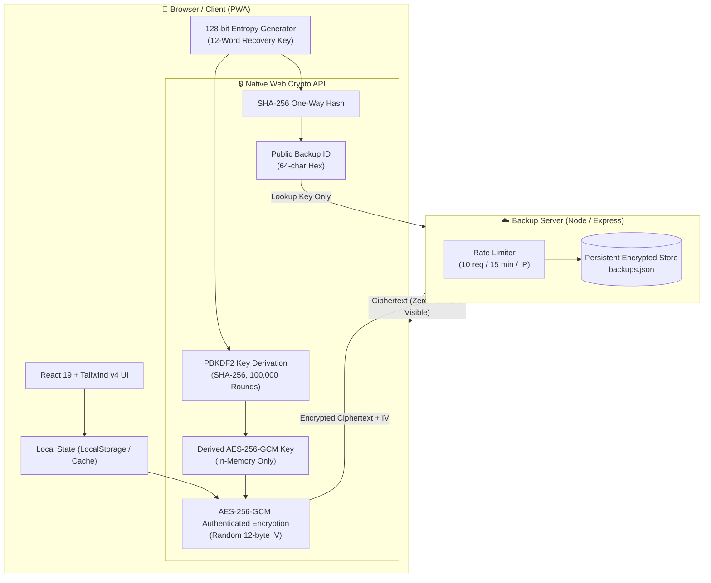

<div align="center">

# 🪙 Gullak (गुल्लक)
### *Simple, Private & Offline-First Budget Progressive Web App*

[](LICENSE)
[](https://react.dev/)
[](https://www.typescriptlang.org/)
[](https://tailwindcss.com/)
[](https://vitejs.dev/)
[](SECURITY.md)
[](public/manifest.json)
[](https://github.com/dot-wasim/Gullak)

<p align="center">
  <b>No accounts. No passwords. No phone numbers. No analytics. No trackers.</b><br>
  Just your budget, stored on your device, backed up with zero-knowledge cryptography.
</p>

[Key Features](#-key-features) •
[Architecture](#-architecture--cryptographic-flow) •
[Zero-Knowledge Security](#-zero-knowledge-security-model) •
[Getting Started](#-getting-started) •
[Project Structure](#-project-structure) •
[Verification & Tests](#-verification--tests) •
[API Reference](#-api-reference)

---

</div>

## 📖 What is Gullak?

**Gullak (गुल्लक)** is the traditional Hindi word for a handcrafted clay piggy bank. It is where households save coins with quiet discipline—without paperwork, without subscriptions, and without third parties watching.

Modern budget and expense apps often force you into phone OTPs, bank credential scraping, intrusive ads, and cloud databases that sell your financial habits to data brokers.

**Gullak brings back the simplicity of the clay piggy bank for the digital age:**
- 🛡️ **Zero-Knowledge by Design:** Your financial data is encrypted on your device using native **AES-256-GCM** before touching any network.
- 📴 **100% Offline-First PWA:** Works seamlessly without an active internet connection. Install it directly onto iOS, Android, or desktop with 1 tap.
- 🔑 **12-Word Recovery Phrase:** No accounts or email required. You own a 12-word cryptographic recovery key that lets you restore your data on any device.
- ⚡ **Sub-5-Second Entry:** Log expenses and income in seconds so managing money never feels like a chore.

---

## ✨ Key Features

| Feature | Description |
| :--- | :--- |
| **⚡ Rapid Expense Logging** | Add expenses in `< 5 seconds`. Category picker, customized dates, validation, and optional notes. |
| **💼 Multi-Stream Income** | Track multiple earnings sources (Salary, Freelance, Dividends, Rental, etc.) with custom stream creation. |
| **🎯 Interactive Savings Goals** | Set targets and deadlines. Make manual deposits ("Add Money") with real-time percentage progress and completion celebrations. |
| **📊 Overview Dashboard** | Instant breakdown of monthly income, expenses, net savings balance, and active goal trajectories. |
| **🔍 Search & Filter History** | Reverse-chronological ledger with search by note/category, inline editing, and deletion with safety confirmations. |
| **🔐 Zero-Knowledge Backup** | Client-side **AES-256-GCM** + **PBKDF2 (100k rounds)**. The backup server only stores opaque ciphertext. |
| **📱 Installable PWA** | Service Worker asset caching, web app manifest, offline persistence, and standalone window launch. |
| **⚙️ Customization** | Multi-currency symbol support (`₹`, `$`, `€`, `£`, `¥`, etc.), customizable categories, and stream tags. |

---

## 🏗️ Architecture & Cryptographic Flow

Gullak isolates all sensitive computation strictly within your browser using the native **Web Crypto API** (`window.crypto.subtle`).



---

## 🔐 Zero-Knowledge Security Model

Gullak adheres strictly to the **Zero-Knowledge Principle**: *the server operator knows neither your recovery key nor your financial data.*

### 1. Entropy & 12-Word Mnemonic
On initial startup, the browser generates 128 bits of cryptographically secure random entropy via `crypto.getRandomValues(new Uint8Array(16))`. This is mapped into 12 simple, human-readable words from an unambiguous vocabulary list.

### 2. Key Derivation (PBKDF2)
The recovery key is normalized and processed through PBKDF2:
- **Algorithm:** PBKDF2
- **Hash Function:** SHA-256
- **Iterations:** 100,000 rounds
- **Salt:** `gullak-encryption-salt-v1`
- **Output:** 256-bit AES-GCM CryptoKey (kept exclusively in volatile browser memory)

### 3. Authenticated Encryption (AES-256-GCM)
Every backup payload is serialized and encrypted client-side:
- **Cipher:** AES-256-GCM (Galois/Counter Mode)
- **IV:** Unique 12-byte (96-bit) cryptographically random nonce per backup
- **Authentication:** GCM authentication tag verifies payload integrity and detects any tampering

### 4. One-Way Public Backup Identifier
The client creates a public identifier for the server to index the backup without revealing the key:
$$\text{Backup ID} = \text{SHA-256}(\text{"gullak-backup-id-v1:"} \parallel \text{normalizedKey})$$
Because SHA-256 is mathematically irreversible, the server cannot derive the recovery key or decrypt the stored payload.

### 5. Brute Force Protection
The restore endpoint (`GET /api/backup/:backupId`) is protected with rate limiting (`10 requests / 15 minutes / IP`). If an attacker attempts to guess a 12-word phrase or brute-force restore IDs, their requests are throttled with HTTP 429.

> [!NOTE]  
> Read our full [SECURITY.md](SECURITY.md) for detailed threat modeling, recovery boundary conditions, and responsible disclosure policies.

---

## 🚀 Getting Started

### Prerequisites
- **Node.js**: `v20.x` or higher (`v22+` recommended)
- **npm**: `v10.x` or higher

### Installation

1. **Clone the repository:**
   ```bash
   git clone https://github.com/dot-wasim/Gullak.git
   cd Gullak
   ```

2. **Install dependencies:**
   ```bash
   npm install
   ```

### Running Locally (Development Mode)

Start both the frontend development server and the backend sync server concurrently:

```bash
# Terminal 1: Start Vite dev server (port 5173 with proxy to backend)
npm run dev

# Terminal 2: Start Express backup server (port 3001)
npm run server
```

Open your browser at **`http://localhost:5173`**.

### Production Build & Self-Hosting

To build the optimized static PWA and run the integrated production server:

```bash
# 1. Build TypeScript and Vite bundle into dist/
npm run build

# 2. Start the unified production server (serves frontend PWA + backup API on port 3001)
npm start
```

Visit **`http://localhost:3001`** in your browser.

---

## 🧪 Verification & Tests

Gullak includes automated verification suites covering end-to-end cryptographic integrity, wrong-key rejection, and rate limiting:

```bash
# Run Cryptographic Unit Tests
npm run test

# Run End-to-End Backup & Restore Integration Suite
npm run test:e2e
```

### Test Coverage Highlights:
- ✅ 12-word recovery key generation (128-bit entropy).
- ✅ Deterministic PBKDF2 (100,000 iterations) key derivation.
- ✅ AES-256-GCM encryption with unique 12-byte IV.
- ✅ Zero-knowledge server verification (verifying ciphertext contains zero plaintext).
- ✅ Restoring and decrypting payload on clean client.
- ✅ Immediate rejection when attempting to restore with an incorrect key.
- ✅ HTTP 429 verification against rapid automated restore attempts.

---

## 📡 API Reference

The lightweight Node/Express server provides zero-knowledge backup endpoints:

| Endpoint | Method | Rate Limit | Description |
| :--- | :---: | :---: | :--- |
| `/api/health` | `GET` | None | Service heartbeat and server timestamp. |
| `/api/backup` | `POST` | Standard | Uploads encrypted ciphertext, IV, and derived Backup ID. |
| `/api/backup/:backupId` | `GET` | 10 req / 15m | Retrieves encrypted blob by Backup ID. Protected against brute-force. |

### Sample POST `/api/backup` Payload
```json
{
  "backupId": "669b79a2c274b45351bbbdc87942e220fde6bc14a923d5e358dd27e2a5959a8e",
  "encryptedData": "bWluaW1hbC1jaXBoZXJ0ZXh0LWV4YW1wbGU...",
  "iv": "z5l1820Vd0Pj0Kqm",
  "version": 1
}
```

---

## 📂 Project Structure

```
Gullak/
├── .github/
│   ├── workflows/ci.yml             # GitHub Actions CI (build + tests)
│   ├── ISSUE_TEMPLATE/              # Bug report & feature request templates
│   └── PULL_REQUEST_TEMPLATE.md     # Standardized PR review checklist
├── public/
│   ├── manifest.json                # PWA web app manifest
│   ├── piggy-bank.svg               # Vector app icon
│   └── sw.js                        # Offline service worker cache
├── server/
│   ├── index.js                     # Express server, backup store, rate limiting
│   └── data/                        # Persistent encrypted storage directory
├── src/
│   ├── components/
│   │   ├── AddEntryModal.tsx        # Rapid expense / income logger
│   │   ├── AddGoalModal.tsx         # Goal creator modal
│   │   ├── AddMoneyModal.tsx        # Goal deposit modal
│   │   ├── DeleteConfirmModal.tsx   # Mandatory deletion safeguard modal
│   │   ├── GoalsView.tsx            # Savings goals list & progress
│   │   ├── HistoryView.tsx          # Filterable & searchable transaction log
│   │   ├── HomeView.tsx             # Main dashboard (summary, net balance)
│   │   ├── OnboardingModal.tsx      # 12-word key ceremony & instant restore
│   │   ├── RestoreModal.tsx         # Cloud backup restore interface
│   │   └── SettingsView.tsx         # Currency, categories, backup status
│   ├── context/
│   │   └── AppContext.tsx           # Global state, persistence, sync hooks
│   ├── lib/
│   │   ├── backupService.ts         # Server communication & sync engine
│   │   ├── crypto.ts                # WebCrypto AES-256-GCM & PBKDF2 logic
│   │   └── storage.ts               # LocalStorage & offline synchronization
│   ├── types/
│   │   └── index.ts                 # TypeScript interfaces & data contracts
│   ├── App.tsx                      # Root component & navigation
│   ├── index.css                    # Tailwind CSS v4 directives
│   └── main.tsx                     # React 19 entrypoint
├── tests/
│   ├── test-crypto.js               # Cryptographic unit test runner
│   └── test-e2e-backup.js           # End-to-end backup & restore test
├── CHANGELOG.md                     # Version history & release notes
├── CONTRIBUTING.md                  # Development guidelines & code style
├── LICENSE                          # MIT License
├── package.json                     # Scripts & dependencies
├── SECURITY.md                      # Threat model & vulnerability policy
└── vite.config.ts                   # Vite + Tailwind v4 bundler configuration
```

---

## 📋 Requirements & Standards Compliance

Gullak was engineered to meet strict technical specifications:

<details>
<summary><b>Click to expand Functional & Non-Functional Requirements (ASD-STE100)</b></summary>
<br>

### Functional Requirements
- **FR-01 to FR-05 (Expense):** Mandatory amount (> 0), category selection, default date to today with custom picker, optional note. Rejects invalid amounts.
- **FR-06 to FR-09 (Income):** Mandatory amount (> 0), multiple income sources with autocomplete & custom creators, default date to today, optional note.
- **FR-10 to FR-14 (Goals):** Goal name and target amount, optional target deadline, manual money deposits, percentage progress bar, and completion celebrations.
- **FR-15 to FR-19 (Home Screen):** Current month income, current month expenses, net savings balance (Income − Expenses), active goals preview, and `< 10-second` quick entry.
- **FR-20 to FR-23 (History):** Reverse chronological order (newest first), search and category filters, inline editing, and deletion with mandatory confirmation modal.

### Backup & Restore (Zero-Knowledge)
- **BR-01 to BR-03:** 128-bit entropy recovery key formatted as 12 simple mnemonic words.
- **BR-04 to BR-05:** First-run onboarding key ceremony with mandatory confirmation ("I saved my key").
- **BR-06:** View recovery key at any time in Settings.
- **BR-07 to BR-09:** Manual one-tap backup, automatic backup when online, and timestamp display of last backup.
- **BR-10 to BR-12:** Restore using recovery key, clear error on incorrect key, warning before replacing local data, and IP-based rate limiting on restore attempts.

### Non-Functional Requirements
- **NF-01:** Instant startup (`< 2 seconds`) with lightweight bundle.
- **NF-02:** 100% offline-ready through Service Worker and Local Storage / IndexedDB.
- **NF-03 & NF-04:** Native Web Crypto API utilizing **AES-256-GCM** encryption and **PBKDF2** (SHA-256, 100,000 iterations) key derivation.
- **NF-05:** Zero telemetry and zero user data sent to analytics.
- **NF-06:** Clean mobile-first responsive layout matching ASD-STE100 principles.

</details>

---

## 🤝 Contributing

We welcome contributions from the community! Whether you are fixing bugs, improving documentation, or optimizing performance, please see our [**Contributing Guide**](CONTRIBUTING.md) to get started.

---

## 📄 License

Gullak is open-source software licensed under the **[MIT License](LICENSE)**.

<div align="center">
  <sub>Built with ❤️ for privacy, financial independence, and simplicity.</sub>
</div>
